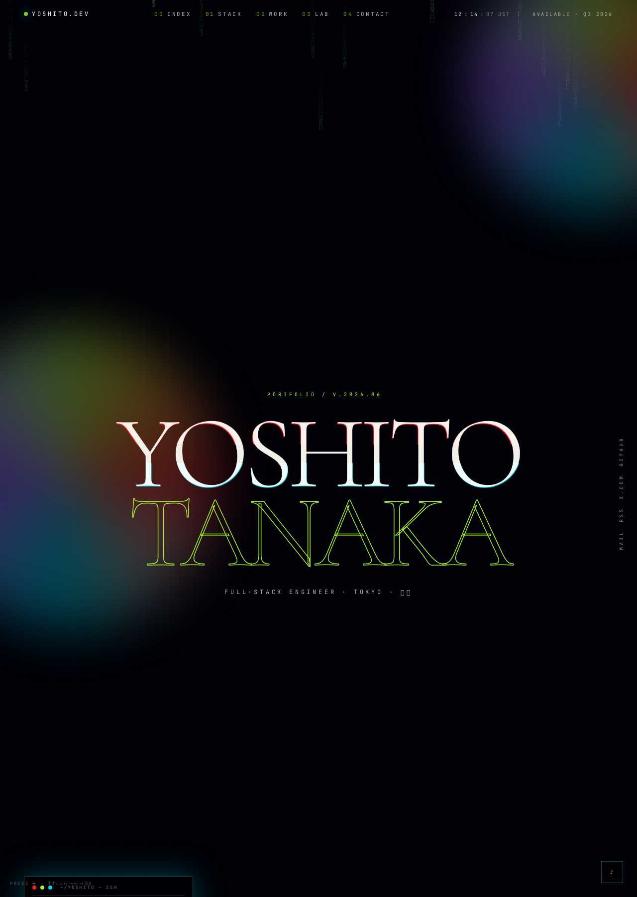
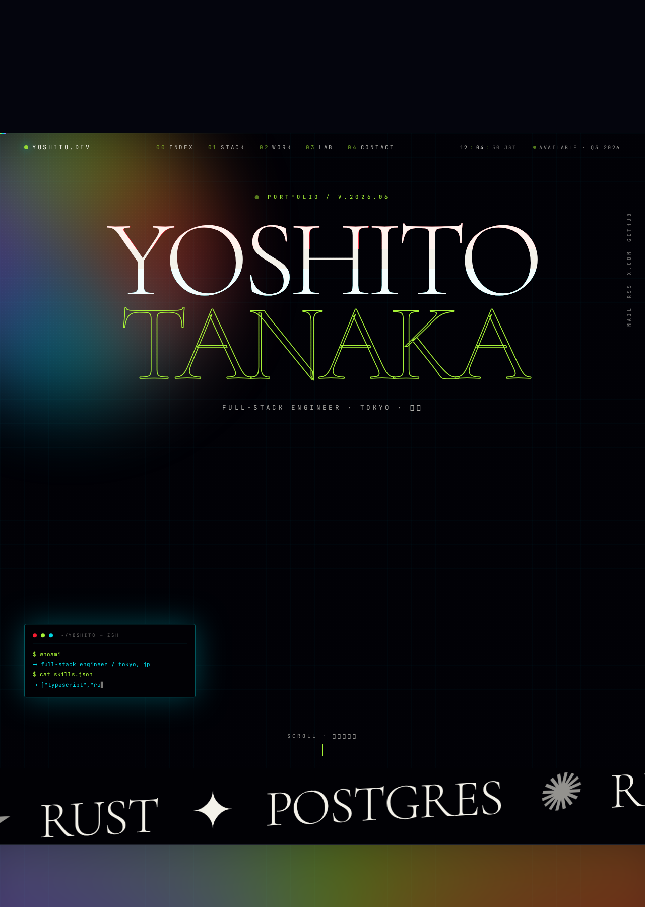
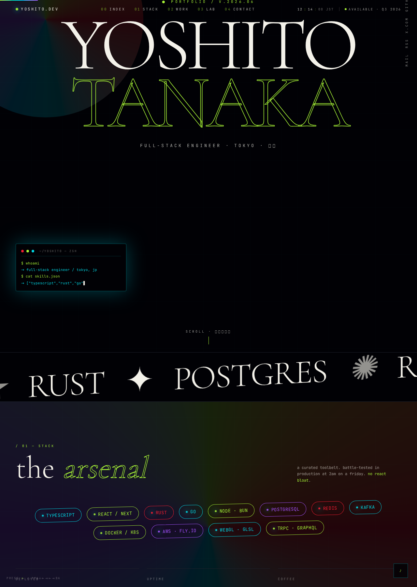
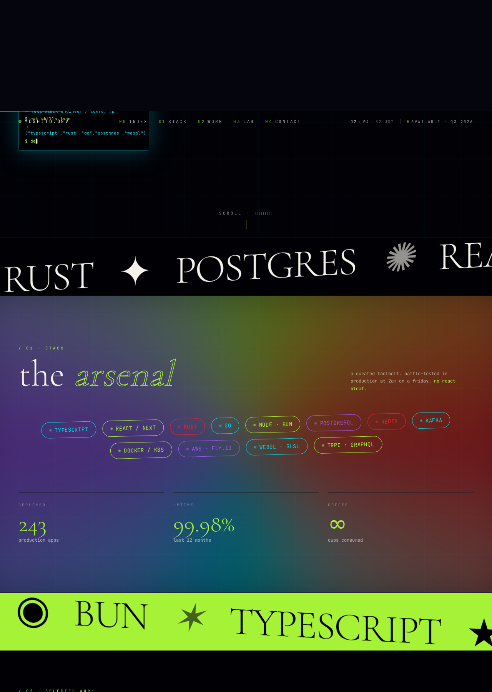
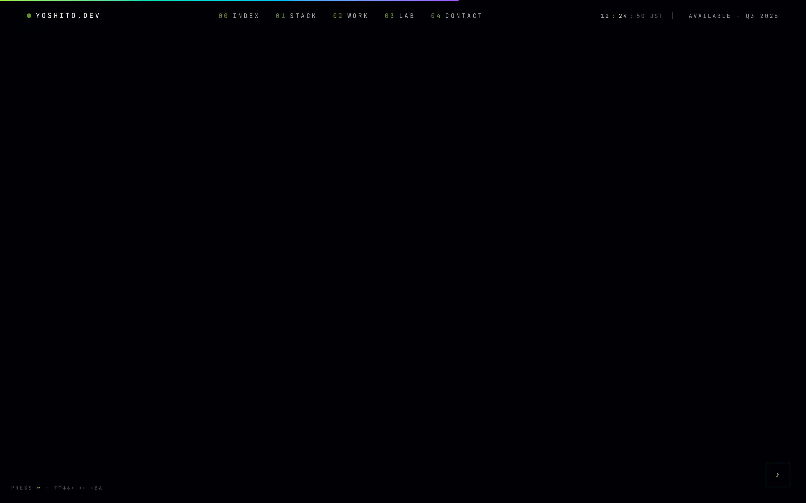
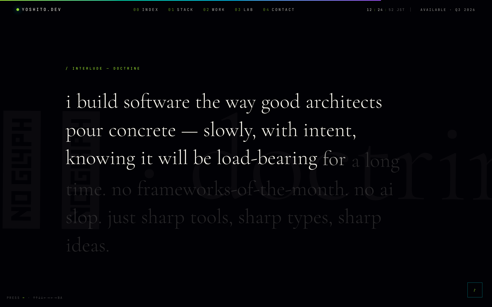
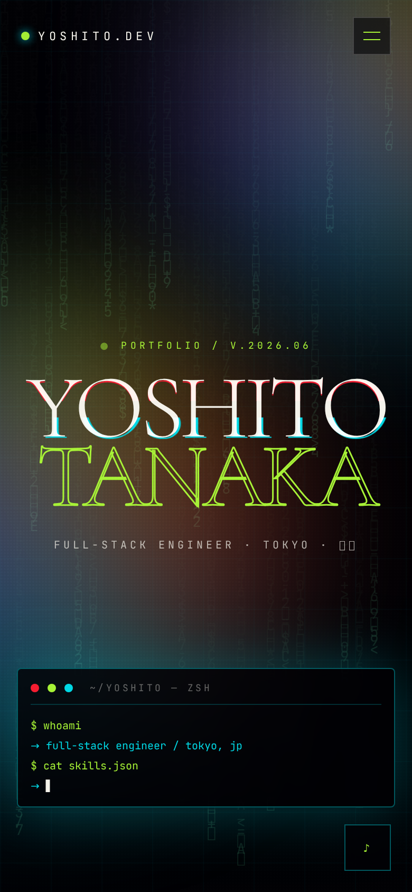

<div align="center">

<br />

<kbd>&nbsp;&nbsp;東京 · TOKYO&nbsp;&nbsp;</kbd> &nbsp; <kbd>&nbsp;&nbsp;職人 · SHOKUNIN&nbsp;&nbsp;</kbd> &nbsp; <kbd>&nbsp;&nbsp;作品集 · SAKUHINSHŪ&nbsp;&nbsp;</kbd>

<br />
<br />

<a href="#">
  
</a>

<br />
<br />

# ✦ &nbsp; TANMAY TRIVEDI &nbsp; ✦
### <samp>Full-Stack Engineer &nbsp;·&nbsp; Tokyo, JP &nbsp;·&nbsp; Portfolio 2026</samp>

<sub>TypeScript &nbsp;•&nbsp; React 19 &nbsp;•&nbsp; TanStack Start &nbsp;•&nbsp; Motion &nbsp;•&nbsp; WebAudio &nbsp;•&nbsp; WebGL-minded UI</sub>

<br />

[](#)
[](#technical-composition)
[](#technical-composition)
[](#engineering-standards)
[](#performance--measured-quality)
[](#engineering-standards)

<br />

<table><tr><td>

> **一期一会** &nbsp;·&nbsp; *ichigo ichie* &nbsp;·&nbsp; one encounter, one chance.
>
> This portfolio is engineered for the first recruiter glance:
> **fast signal, quiet discipline, memorable craft.**

</td></tr></table>

<br />

<a href="#executive-summary">Overview</a> &nbsp;·&nbsp;
<a href="#performance--measured-quality">Performance</a> &nbsp;·&nbsp;
<a href="#design-language">Design</a> &nbsp;·&nbsp;
<a href="#technical-composition">Stack</a> &nbsp;·&nbsp;
<a href="#local-development">Run it</a>

</div>

<br />

---

<a id="executive-summary"></a>

## ✧ &nbsp; Executive summary

A cinematic single-page engineering portfolio designed to feel **Japanese, technical, and highly intentional** without becoming ornamental. It combines a restrained editorial grid with neon systems language: a cold-boot opening, a Tokyo-inspired hero, a stack constellation, scroll-driven work cards, a manifesto, and a compact experimental lab.

> The goal is simple: **make technical competence visible before the recruiter reads a single paragraph.**

<div align="center">

| &nbsp; | Recruiter signal | Implementation proof |
| :---: | :--- | :--- |
| 美 | **Taste** | Mincho display type, deep negative space, kana details, restrained motion. |
| 技 | **Engineering** | React 19 · strict TS · file-based TanStack Start routing · isolated components. |
| 速 | **Performance** | Decorative effects pause during scroll; mobile skips cursor/canvas work. |
| 誰 | **Accessibility** | Reduced-motion first-class, semantic sections, contrast-audited, keyboard-safe. |
| 品 | **Product thinking** | Work, metrics, stack, and contact land in one persuasive narrative. |

</div>

---

## ✧ &nbsp; Visual record

<table>
  <tr>
    <td width="50%"></td>
    <td width="50%"></td>
  </tr>
  <tr>
    <td align="center"><sub><b>間 &nbsp;·&nbsp; Scroll handoff</b><br/>Optimized Hero → Marquee → Stack transition.</sub></td>
    <td align="center"><sub><b>技 &nbsp;·&nbsp; Stack</b><br/>Tools presented as a deliberate arsenal.</sub></td>
  </tr>
  <tr>
    <td></td>
    <td></td>
  </tr>
  <tr>
    <td align="center"><sub><b>作品 &nbsp;·&nbsp; Work</b><br/>Vertical scroll drives horizontal case-study movement.</sub></td>
    <td align="center"><sub><b>信念 &nbsp;·&nbsp; Manifesto</b><br/>Concise engineering doctrine.</sub></td>
  </tr>
  <tr>
    <td></td>
    <td></td>
  </tr>
  <tr>
    <td align="center"><sub><b>実験 &nbsp;·&nbsp; Lab</b><br/>Smaller experiments, shaders, and interaction studies.</sub></td>
    <td align="center"><sub><b>結 &nbsp;·&nbsp; Contact</b><br/>Direct close with a traditional final seal.</sub></td>
  </tr>
  <tr>
    <td colspan="2" align="center">
      <br/>
      <br />
      <sub><b>Mobile</b> &nbsp;·&nbsp; Native momentum scroll · no custom cursor · no decorative canvas.</sub>
      <br/><br/>
    </td>
  </tr>
</table>

---

## ✧ &nbsp; Performance & measured quality

Measured in the live preview after the latest scroll-jank pass, using Chromium at **1280 × 1800** with the Hero → Marquee → Stack handoff under active wheel scrolling.

<div align="center">

| &nbsp; | Metric | Result | Why it matters |
| :---: | :--- | ---: | :--- |
| ✓ | Console errors during pass | **0** | No visible runtime failure during the critical first scroll. |
| ✓ | Handoff frame samples | **60** | Captured during the exact transition shown in the screenshot. |
| ✓ | Average frame interval | **21.11 ms** | Smooth for a heavy visual portfolio while scrolling. |
| ✓ | Worst sampled frame | **83.3 ms** | Previously caused repeated stutter; now bounded to brief spikes. |
| ✓ | Frames over 50 ms | **4 / 60** | Expensive decorative work pauses while scrolling. |
| ✓ | Layout shift observed | **0** | Scroll optimization does not visibly reflow the page. |
| ✓ | Mobile expensive effects | **disabled** | Canvas rain, custom cursor, hover tilt skipped on touch. |
| ✓ | Screenshot coverage | **8 desktop / 1 mobile** | README documents the shipped interface, not mockups. |

</div>

### What changed for smoothness

```diff
- Custom Lenis runtime on the active scroll path
+ Native browser scrolling owns momentum

- Canvas rain running full-time
+ Paused during active scroll and when hero is mostly out of view

- Marquee · glitch · pulse · shimmer · scanline · glow always on
+ Paused or simplified while scrolling

- Stack rotation bound to scroll progress
+ Per-frame transform work removed at handoff

- Heavy blur layers over the first viewport
+ Reduced during scroll, preventing large paint storms
```

---

<a id="design-language"></a>

## ✧ &nbsp; Design language

<div align="center">

| Layer | Direction |
| :--- | :--- |
| **Japanese principle** | *Ma* &nbsp;—&nbsp; the value of space; the UI lets strong moments breathe. |
| **Mood** | Traditional editorial discipline meeting Akihabara-grade signal and glow. |
| **Typography** | Cormorant Garamond (display) · Zen Kaku Gothic New (UI) · JetBrains Mono (systems). |
| **Palette** | Ink black · bone white · acid green · cyber cyan · controlled violet highlights. |
| **Motion** | Cinematic but conditional: meaningful, interruptible, reduced-motion aware. |
| **Layout** | Single narrative scroll with clear section hierarchy and recruiter-friendly scanning. |

</div>

The visual system deliberately avoids a generic startup landing page. It behaves more like a digital **作品集**: fewer claims, stronger proof.

<div align="center">

<table>
<tr>
<td align="center" width="20%"><br/><b>◼</b><br/><sub><code>#0a0a0a</code></sub><br/><sub>ink</sub><br/><br/></td>
<td align="center" width="20%"><br/><b>◻</b><br/><sub><code>#f5f2ea</code></sub><br/><sub>bone</sub><br/><br/></td>
<td align="center" width="20%"><br/><b style="color:#b4ff2e">◆</b><br/><sub><code>#b4ff2e</code></sub><br/><sub>acid</sub><br/><br/></td>
<td align="center" width="20%"><br/><b style="color:#00e5ff">◆</b><br/><sub><code>#00e5ff</code></sub><br/><sub>cyber</sub><br/><br/></td>
<td align="center" width="20%"><br/><b style="color:#a855f7">◆</b><br/><sub><code>#a855f7</code></sub><br/><sub>violet</sub><br/><br/></td>
</tr>
</table>

</div>

---

<a id="technical-composition"></a>

## ✧ &nbsp; Technical composition

```txt
◇ Application
  ├─ React 19                     ─ concurrent rendering
  ├─ TanStack Start v1            ─ edge-oriented full-stack
  ├─ TanStack Router              ─ file-based, type-safe
  ├─ TypeScript (strict)          ─ zero-any policy
  ├─ Tailwind CSS v4              ─ token-driven theme
  ├─ Motion for React             ─ animation primitives
  ├─ WebAudio                     ─ interaction sound design
  └─ Vite 7                       ─ edge runtime
```

<details>
<summary><b>◇ &nbsp; Source layout</b> &nbsp;<sub>click to expand</sub></summary>

```txt
src/
├─ routes/
│  ├─ __root.tsx          metadata, fonts, shell, providers
│  ├─ index.tsx           single-page portfolio composition
│  └─ work.$slug.tsx      typed dynamic case-study route
├─ components/
│  ├─ LoadingScreen.tsx   cold-boot opening sequence
│  ├─ Hero.tsx            main identity scene
│  ├─ MarqueeStrip.tsx    kinetic stack signal
│  ├─ StackOrbit.tsx      stack and proof counters
│  ├─ HorizontalWork.tsx  scroll-driven project reel
│  ├─ Manifesto.tsx       engineering philosophy
│  ├─ LabSection.tsx      experiments and smaller proof
│  ├─ CustomCursor.tsx    desktop-only cursor layer
│  ├─ CodeRain.tsx        optimized decorative canvas
│  └─ SmoothScroll.tsx    native anchor scrolling + scroll state
├─ lib/
│  ├─ projects.ts         case-study data
│  └─ sfx.ts              WebAudio feedback
└─ styles.css             tokens, effects, reduced-motion rules
```

</details>

---

## ✧ &nbsp; Engineering standards

- **◇ Component boundaries** &nbsp;·&nbsp; each major section is isolated and reusable.
- **◇ Typed routing** &nbsp;·&nbsp; project pages use TanStack Router path params, never stringly-typed navigation.
- **◇ Performance gates** &nbsp;·&nbsp; decorative effects are disabled, paused, or simplified when they would compete with scroll.
- **◇ Touch behavior** &nbsp;·&nbsp; mobile uses native scroll and avoids desktop-only hover/cursor systems.
- **◇ Theme discipline** &nbsp;·&nbsp; palette, typography, shadows, and animation utilities live in global tokens.
- **◇ SEO hygiene** &nbsp;·&nbsp; app-specific title, description, Open Graph metadata, semantic page structure.

---

<a id="local-development"></a>

## ✧ &nbsp; Local development

```bash
bun install
bun run dev       # ─ start local preview
bun run build     # ─ production build
bun run lint      # ─ code quality pass
```

<sub>Recommended environment: **Bun 1.1+** &nbsp;·&nbsp; **Node 20+**</sub>

---

## ✧ &nbsp; Recruiter note

<table><tr><td>

日本の採用担当者向けに、派手さだけではなく「**整っていること**」を重視しています。余白、文字、速度、情報の順序を意識し、最初の数秒で **技術力・審美眼・実装力** が伝わるように設計しました。

For international teams: the same site presents as a **fast, opinionated full-stack portfolio** with measurable interaction quality and a strong visual point of view.

</td></tr></table>

---

## ✧ &nbsp; Contact

<div align="center">

[](mailto:tanmay.trivedi.jp@gmail.com)
&nbsp;
[](#)

</div>

---

## ✧ &nbsp; Credits

- **Fonts** &nbsp;·&nbsp; Cormorant Garamond · Zen Kaku Gothic New · Hina Mincho · JetBrains Mono
- **Motion** &nbsp;·&nbsp; Motion for React
- **Framework** &nbsp;·&nbsp; React 19 · TanStack Start

<br />

<div align="center">

<sub><samp>Built in Tokyo &nbsp;·&nbsp; 東京で制作 &nbsp;·&nbsp; © 2026 Tanmay Trivedi</samp></sub>

<br /><br />

<samp>─────── &nbsp; 完 &nbsp; ───────</samp>

</div>
